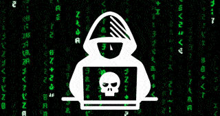

# Cyber_Hacker Theme for Bruce Firmware

[](https://github.com/CreeperRick/Cyber_Hacker)
[](https://https://bruce.computer/)
[](https://github.com/CreeperRick/Cyber_Hacker/releases)
[](https://github.com/CreeperRick/Cyber_Hacker/releases)

## Preview



*Animated boot sequence with cyberpunk hacker aesthetic*

## Features

- 🖥️ Terminal-inspired color scheme with neon green (#00FF00) primary
- 🔋 Animated GIF icons for all apps (WiFi, BLE, RF, RFID, FM, Files, IR, GPS, NRF24, JS Interpreter, and more)
- 💚 Custom LED effects with configurable speed and direction
- 🔤 Hacker-style typography with high contrast visibility
- 🎮 Gaming-optimized layout with clean, minimal borders
- 🔧 Complete theme configuration with all Bruce Firmware features supported

## Installation

### Method 1: Bruce App Store (Recommended)
1. Open **Bruce Configurator**
2. Navigate to **App Store** section
3. Search for **"Cyber Hacker"** or **"Cyber_Hacker"**
4. Click **"Install Theme"**
5. Apply theme to your layout

### Method 2: Manual Installation
1. Download the theme files from GitHub
2. Ensure you have the complete `Cyber_Hacker` folder with all GIF files
3. Place the folder in your Bruce themes directory
4. Open Bruce Configurator
5. Select **"Load Theme"** from the theme menu
6. Navigate to the `Cyber_Hacker` folder and select `theme.json`

## Theme Configuration

The theme uses the following configuration:

```json
{
  "wifi": "WiFi.gif",
  "ble": "BLE.gif",
  "rf": "RF.gif",
  "rfid": "RFID.gif",
  "fm": "FM.gif",
  "files": "Files.gif",
  "ir": "IR.gif",
  "gps": "GPS.gif",
  "nrf": "NRF24.gif",
  "interpreter": "JSInterpreter.gif",
  "others": "Others.gif",
  "connect": "Connect.gif",
  "clock": "Clock.gif",
  "config": "Config.gif",
  "ethernet": "Ethernet.gif",
  "lora": "LoRa.gif",
  "border": 0,
  "label": 0,
  "name": "Cyber Hacker",
  "author": "CreeperRick",
  "priColor": "858b",
  "secColor": "3b86",
  "bgColor": "0000",
  "ledBright": "30",
  "ledColor": "208f1e",
  "ledEffect": "0",
  "ledEffectSpeed": "5",
  "ledEffectDirection": 1,
  "gifDuration": -1
}
```
